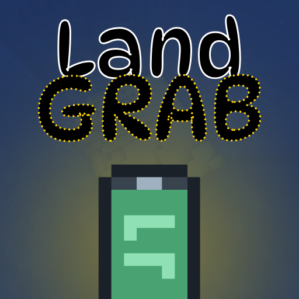
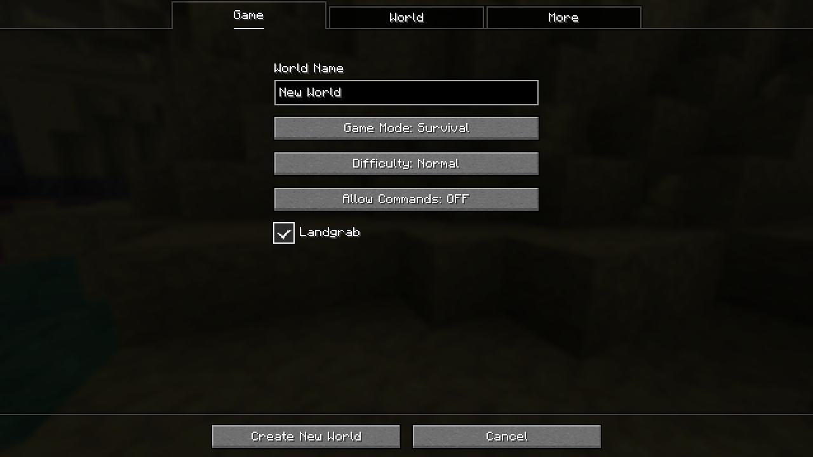
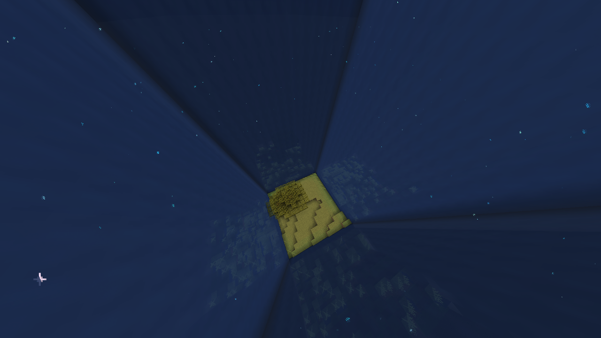
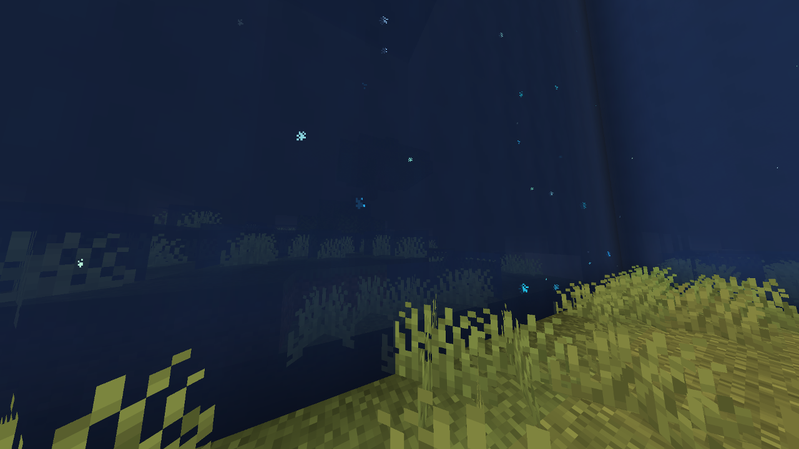
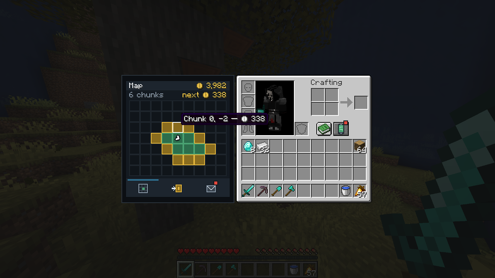
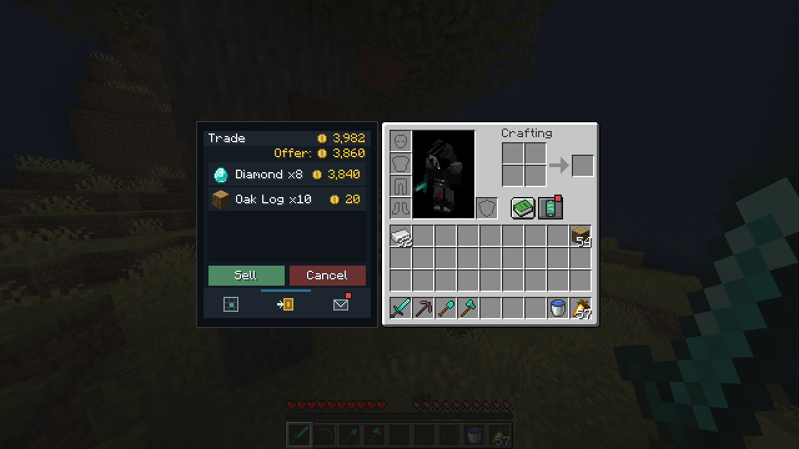
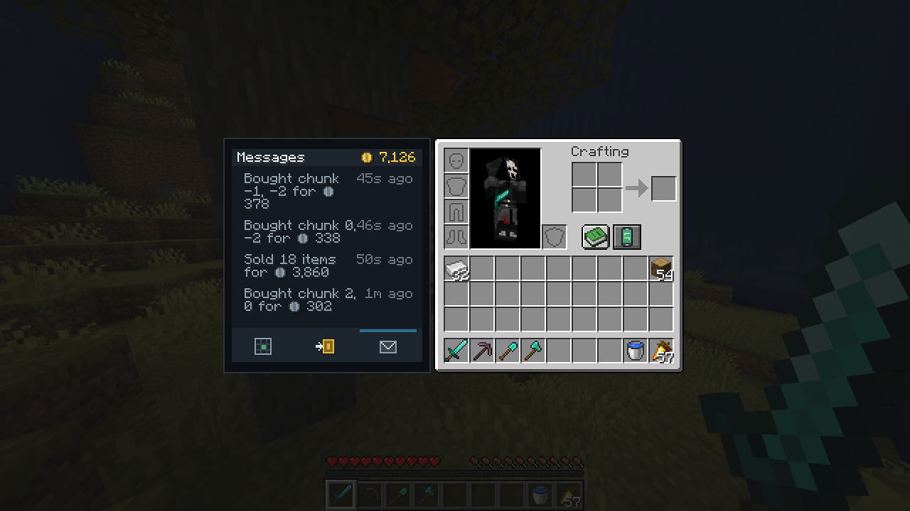
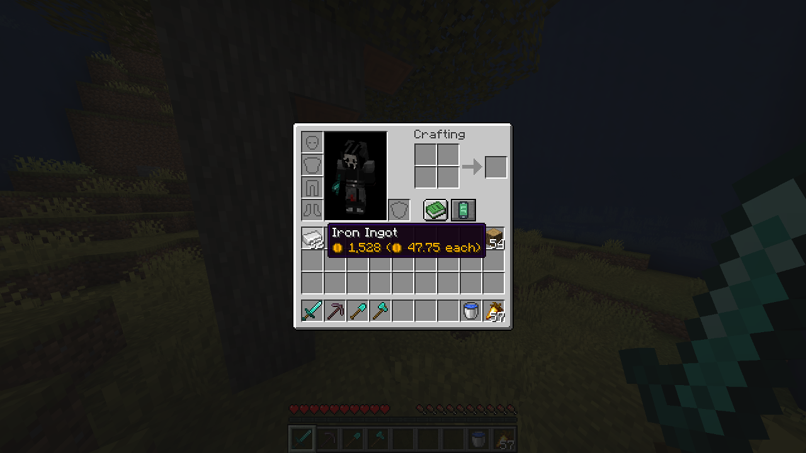

<div align="center">



# Landgrab

**Start in one chunk. Buy your way out.**

[](https://www.minecraft.net)
[](https://fabricmc.net)
[](LICENSE)

</div>

---

Landgrab is a Fabric game mode that starts you confined to a single chunk. Everything
outside it is walled off behind an electric haze. Sell what you gather through a phone in
your inventory, and buy your way outward one chunk at a time.

## Downloads

Releases are published on [Modrinth](https://modrinth.com/mod/landgrab) and on the
[GitHub releases page](https://github.com/oliver-richman/landgrab/releases).

## Installation

| Requirement | Version |
| --- | --- |
| Minecraft | 26.2 |
| Loader | Fabric Loader 0.19.3 or newer |
| Java | 25 or newer |
| Fabric API | Not required. The modules Landgrab uses are bundled |

Drop the jar into your `mods` folder. Landgrab is off by default: tick **Landgrab** on the
**Game** tab when creating a world.



Existing worlds can be switched with the `landgrab:landgrab` game rule. The mod must be
installed on both the client and the server.

## Playing

### Your chunk

You start owning the chunk you spawn in and nothing else. You cannot walk, build or mine
into land you do not own, and touching the boundary hurts and throws you back. Locked
chunks still load, so mobs walk about in them and you can make out the first block or so.
Past that the haze hides everything.





### The phone

Opens from a button beside the recipe book in your inventory, or with `B`. It has three
apps.

**Map** shows the chunks around you. The ones you own are green, the ones you can buy are
gold and priced. Click to buy.



**Trade** takes stacks dragged onto the counter, groups them into rows, and totals them.
Sell the lot or take it back.



**Messages** is what has happened, newest first, with unread ones marked.



### Money

When a world loads, Landgrab reads its recipes and works out what everything is worth.
Anything craftable is priced at the cheapest way of making it, so crafting never turns a
profit, and nothing that multiplies when processed pays more than it came from. Raw
materials that no recipe reaches carry a set price, and whatever is still unpriced is read
off the item itself. A data pack that changes crafting changes the prices with it.

Prices go to a quarter of a coin, so cheap things stay sellable. A part-used tool is worth
the part of it that is left, and enchantments add to the price, each one weighted by how
rare the game makes it. Fortune pays more than Efficiency. Hovering any stack anywhere
shows what the phone would pay.



### Other rules

**Advancements pay**, graded by the game's own difficulty rating, which matters early on
when one chunk gives you very little to sell.

**The Nether and the End** each have their own territory, bought separately. The chunk you
first arrive in is free; a portal that would drop you on land you do not own will not fire.

**On a server**, land and money belong to the world. Everyone spends from the same balance
and walks the same borders.

**Creative and spectator** ignore all of it. The boundary, the mining limit, the portal
check and the haze are all lifted, so you can fly out and look at the world as it really
is. Switch back and the haze returns.

## Commands

Everything acts on the dimension you are standing in.

| Command | Who | What |
| --- | --- | --- |
| `/landgrab status` | anyone | Chunks owned here, balance, next price, where this frontier started |
| `/landgrab pay <amount>` | operators | Add coins |
| `/landgrab grant <x> <z>` | operators | Claim a chunk here without paying |

## Building

```sh
./gradlew build
```

The jar lands in `build/libs/`. You need a JDK 25 on the path; everything else is fetched
by Gradle.

To run the development client or a development server:

```sh
./gradlew runClient
./gradlew runServer
```

## Contributing

Issues and pull requests are welcome on the
[issue tracker](https://github.com/oliver-richman/landgrab/issues).

**Translations** are the easiest way to help. Copy
`src/main/resources/assets/landgrab/lang/en_us.json`, rename it to your locale, translate
the values, and open a pull request.

**Bug reports** are much more useful with the Minecraft version, the loader version, the
Landgrab version, and a log. If the game crashed, attach the crash report.

## License

[MIT](LICENSE).
